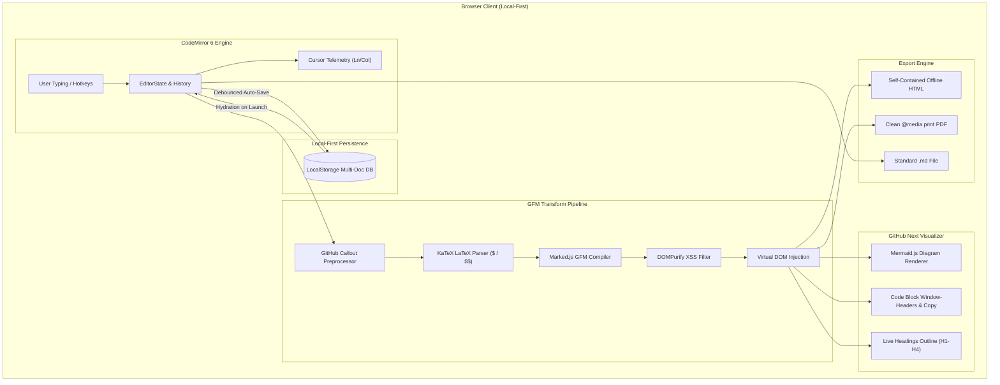

# ⚡ mdview Studio

<div align="center">

[](https://ilyan321.github.io/mdview/)
[](https://react.dev/)
[](https://codemirror.net/)
[](https://tailwindcss.com/)
[](LICENSE)

**The high-performance, developer-first Markdown studio engineered for authentic GitHub Next visual fidelity.**

[Explore Live Studio](https://ilyan321.github.io/mdview/) • [Feature Matrix](#-feature-comparison-matrix) • [Architecture](#-architecture--data-flow) • [Local Setup](#-quick-start)

</div>

---

## 🎯 Overview

`mdview Studio` is a zero-latency, local-first developer workstation engineered for writing, previewing, and publishing technical documentation. Built on the modern **CodeMirror 6** extensible text editor engine and an authentic **GitHub Next** visualization renderer, `mdview` eliminates the friction between raw source editing and publish-ready GitHub markdown.

Unlike generic rich-text web editors or floaty AI wrappers, `mdview` is designed with strict developer aesthetics: high informational density, sub-16ms typing latency, 1px architectural borders, full keyboard navigability, and zero cloud lock-in.

---

## ✨ Key Features

### 🖥️ 1. Modern Developer Studio Shell
* **Multi-Document Tab Manager:** Seamlessly manage multiple markdown buffers with independent history, active tab tracking, close buttons, and instant new tab creation (`+`).
* **Collapsible Studio Sidebar:** 
  * **Document Explorer:** Quick-switch between documents, create new files from pre-configured engineering templates, or delete documents.
  * **Interactive Document Outline:** Automatically extracts `# H1` through `#### H4` headers into a live, hierarchical Table of Contents. Click any heading to jump directly to that exact line in CodeMirror and the preview.
* **Telemetry Status Bar:** Real-time metrics tracking line number, column coordinates, word count, character count, estimated reading time, UTF-8 encoding, and auto-save persistence status.
* **Resizable Dual-Pane Split:** Smooth, hardware-accelerated draggable divider allowing flexible side-by-side editing, full-editor view, or full-preview canvas.

### ✍️ 2. CodeMirror 6 Editor Engine
* **Native CodeMirror 6 Core:** Engineered on modern `@codemirror/state` and `@codemirror/view` architectures.
* **Typing Diagnostics:** Active line highlighting, line numbers gutter, smart bracket auto-closing, and indentation guides.
* **Synchronized Proportional Scrolling:** Smoothly aligns editor cursor position with preview output in real time.
* **Quick Markdown Toolbar:** Instant single-click formatting insertion for Bold (`**`), Italic (`*`), Strikethrough (`~~`), Headings (`#`), Unordered Lists, Task Lists (`- [ ]`), Inline Code, Blockquotes, GFM Tables, and Links.

### 🎨 3. Authentic GitHub Next Visualizer
* **Pixel-Perfect GitHub Callouts:** Native support for all 5 GitHub alert blocks (`[!NOTE]`, `[!TIP]`, `[!IMPORTANT]`, `[!WARNING]`, `[!CAUTION]`) with custom accent borders and status icons.
* **Interactive Mermaid.js Architecture Diagrams:** Live client-side rendering of flowcharts, sequence diagrams, state machines, class hierarchies, and git graphs directly from ````mermaid``` code fences.
* **KaTeX LaTeX Math Engine:** Full support for inline equations (`$E = mc^2$`) and display formulas (`$$\int_{-\infty}^{\infty} e^{-x^2} dx = \sqrt{\pi}$$`).
* **Studio Code Blocks:** Window-header code blocks displaying syntax badges, line count indicators, and 1-click clipboard copy with animated verification feedback.
* **Sanitized DOM Output:** Enterprise-grade XSS protection via `DOMPurify` for secure rendering of dynamic user markdown.

### 📤 4. Professional Export Suite
* **Self-Contained Standalone HTML:** Exports an offline `.html` file with embedded stylesheets, KaTeX fonts, Mermaid engine, and GitHub styling that renders identically on any machine with zero internet connectivity.
* **Clean Rendered HTML to Clipboard:** Copies sanitized semantic HTML ready to paste directly into CMS platforms, documentation portals, or emails.
* **Raw Markdown Export & Copy:** 1-click `.md` download and clipboard copy.
* **Print & PDF Engine:** Customized `@media print` stylesheet with optimized margins (`15mm 20mm`), automated page-break avoidance for code blocks and tables, and UI chrome suppression for clean executive PDF generation (`Ctrl+P` / Print button).

### 🌓 5. Studio Themes (WCAG 2.1 AAA Compliant)
* **GitHub Dark:** The canonical GitHub developer dark palette (`#0d1117` / `#161b22`).
* **Dark High Contrast:** Enhanced contrast boundaries for demanding lighting environments (`#010409` / `#0d1117`).
* **VS Code Modern:** Inspired by the default VS Code dark aesthetic (`#181818` / `#1f1f1f`).
* **GitHub Light:** Crisp light theme with strict typographical contrast (`#ffffff` / `#f6f8fa`).

---

## 🏛️ Architecture & Data Flow



---

## 📊 Feature Comparison Matrix

| Feature | `mdview Studio` | VS Code Markdown | Standard Web Editors | Notion / Obsidian |
| :--- | :---: | :---: | :---: | :---: |
| **Instant Zero-Install Access** | ✅ Web + Offline | ❌ Desktop App | ✅ Web | ❌ App / Account |
| **Local-First (Zero Cloud Storage)** | ✅ 100% Private | ✅ Local Files | ❌ Cloud Required | ❌ Hybrid / Cloud |
| **Live Mermaid.js Diagrams** | ✅ Built-in | ⚠️ Extension Req. | ❌ Rare | ⚠️ Limited |
| **KaTeX Math Formula Parsing** | ✅ Inline & Block | ⚠️ Extension Req. | ❌ Rare | ✅ Built-in |
| **Native GitHub Callouts (`[!NOTE]`)** | ✅ Fully Styled | ⚠️ Inconsistent | ❌ No | ❌ Custom callouts |
| **Self-Contained Standalone HTML Export** | ✅ 1-Click | ❌ Extension Req. | ❌ Rare | ❌ No |
| **Code Block 1-Click Copy & Headers** | ✅ Built-in | ❌ Basic | ⚠️ Inconsistent | ⚠️ Basic |
| **Interactive Live Outline (TOC)** | ✅ Dynamic Tree | ⚠️ Outline View | ❌ Rare | ⚠️ Sidebar |
| **Pure Clean PDF Print Stylesheet** | ✅ No UI Chrome | ⚠️ Browser print | ❌ Distorted | ⚠️ Paid/Export |

---

## 🚀 Quick Start

### Prerequisites
* **Node.js**: v18.0.0 or higher
* **npm**: v9.0.0 or higher

### Local Development Setup

```bash
# 1. Clone the repository
git clone https://github.com/Ilyan321/mdview.git
cd mdview

# 2. Install dependencies
npm install

# 3. Start local development server
npm run dev
```

Visit `http://localhost:3000` (or the port specified by Vite in your terminal) to explore the studio.

### Production Build

```bash
# Build optimized static distribution bundle
npm run build

# Preview production build locally
npm run preview
```

---

## 🛠️ Technology Stack

| Layer | Technologies |
| :--- | :--- |
| **Core Framework** | [React 19](https://react.dev/) + [Vite 8](https://vitejs.dev/) |
| **Editor Core** | [CodeMirror 6](https://codemirror.net/) (`@codemirror/state`, `@codemirror/view`, `@codemirror/lang-markdown`) |
| **Markdown Compiler** | [Marked.js](https://marked.js.org/) (GitHub Flavored Markdown spec) |
| **Diagram Engine** | [Mermaid.js 10](https://mermaid.js.org/) |
| **Mathematics Engine**| [KaTeX 0.16](https://katex.org/) |
| **Syntax Highlighting**| [Highlight.js 11](https://highlightjs.org/) |
| **Sanitization** | [DOMPurify 3](https://github.com/cure53/DOMPurify) |
| **Styling & Icons** | [Tailwind CSS](https://tailwindcss.com/) + [Lucide React](https://lucide.dev/) |
| **Continuous Delivery**| [GitHub Actions](https://github.com/features/actions) → [GitHub Pages](https://pages.github.com/) |

---

## 📂 Project Structure

```text
mdview/
├── .github/
│   └── workflows/
│       └── deploy.yml         # Automated GitHub Actions deployment to GitHub Pages
├── dist/                      # Production build output
├── public/                    # Static assets
├── src/
│   ├── App.jsx                # Studio Shell, State Database & Visualizer Pipeline
│   ├── templates.js           # Built-in Engineering Templates (PRD, Spec, Guide, etc.)
│   └── index.css              # Custom font bindings and base resets
├── index.html                 # CDN injections (Mermaid, KaTeX, Inter/JetBrains fonts)
├── package.json               # Dependencies and scripts
├── vite.config.js             # Vite build configuration with base path routing
├── PRD.md                     # Comprehensive Product Requirements Document
└── README.md                  # Portfolio-grade documentation
```

---

## 🤝 Contributing

Contributions, bug reports, and suggestions are welcome!

1. Fork the Project (`https://github.com/Ilyan321/mdview/fork`)
2. Create your Feature Branch (`git checkout -b feature/AmazingFeature`)
3. Commit your Changes (`git commit -m 'feat: add some AmazingFeature'`)
4. Push to the Branch (`git push origin feature/AmazingFeature`)
5. Open a Pull Request

---

## 📄 License

Distributed under the MIT License. See `LICENSE` for more information.

---

<div align="center">
  <sub>Engineered by <a href="https://github.com/Ilyan321">@Ilyan321</a>. Built for developers who care about craft.</sub>
</div>
